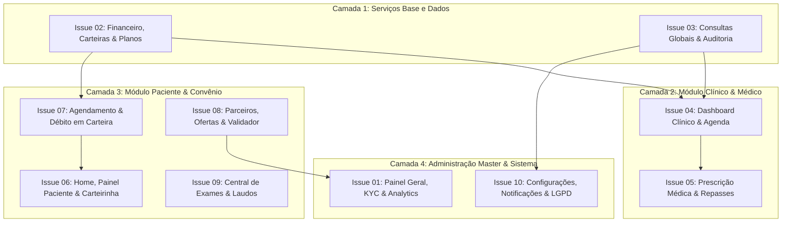

# Plano Mestre de Implementação das Issues (`plan.md`)
**Data e Hora de Geração:** 30 de Agosto de 2026 às 20:40:00 (Horário de Brasília - BRT / UTC-3)  
**Documento Base:** Issues 01 a 10 em `/analytics/issues/`  
**Objetivo:** Estabelecer o plano de pesquisa, ordem de dependências, arquitetura de dados e protocolo de validação técnica para a execução segura de todas as issues, sem introduzir novas features e garantindo zero regressões no sistema existente.

---

## 1. Mapeamento de Dependências e Ordem de Execução

Para garantir que nenhuma alteração quebre fluxos dependentes, a execução das issues deve seguir uma ordem estritamente em camadas:

### Fases de Execução:
1. **Fase 1 (Core Financeiro & Agendamentos):** `Issue 02` [CONCLUÍDO] e `Issue 03` [CONCLUÍDO]  
   *Garante integridade nas transações de débito, estorno, split e auditoria.*
2. **Fase 2 (Fluxo Médico & Clínico):** `Issue 04` e `Issue 05`  
   *Conclusão formal de consulta, crédito imediato na carteira médica e emissão de receita em PDF.*
3. **Fase 3 (Fluxo do Paciente & Benefícios):** `Issue 06`, `Issue 07`, `Issue 08` e `Issue 09`  
   *Agendamento com pagamento via ViTTA Coins, cancelamento autônomo com estorno, carteirinha com QR Code, validador de vouchers e visualizador de exames.*
4. **Fase 4 (Administração Master, Notificações & Sistema):** `Issue 01` e `Issue 10`  
   *Analytics dinâmico, validação de KYC, ações em lote de notificações, troca de senha no Firebase Auth e LGPD.*

---

## Status de Execução das Etapas

| Fase | Issue | Descrição | Status |
| :--- | :--- | :--- | :--- |
| **Fase 1** | **Issue 02** | Financeiro, Carteiras, Saques Pix & Planos | ✅ **Concluído** |
| **Fase 1** | **Issue 03** | Consultas Globais, Reagendamento, Estornos & Auditoria | ✅ **Concluído** |
| **Fase 2** | **Issue 04** | Dashboard Clínico, SOAP & Agenda Médica | ⏳ Pendente |
| **Fase 2** | **Issue 05** | Prescrição Médica & Repasses | ⏳ Pendente |
| **Fase 3** | **Issue 06** | Home, Painel Paciente & Carteirinha | ⏳ Pendente |
| **Fase 3** | **Issue 07** | Agendamento & Débito em Carteira | ⏳ Pendente |
| **Fase 3** | **Issue 08** | Parceiros, Ofertas & Validador | ⏳ Pendente |
| **Fase 3** | **Issue 09** | Central de Exames & Laudos | ⏳ Pendente |
| **Fase 4** | **Issue 01** | Painel Geral, KYC & Analytics | ⏳ Pendente |
| **Fase 4** | **Issue 10** | Configurações, Notificações & LGPD | ⏳ Pendente |

---

## 2. Pesquisa de Arquitetura & Contratos de Dados no Firestore

### 2.1 Coleção `appointments` (Consultas)
* **Novos campos necessários:**
  - `rescheduledBy`: `"patient" | "professional" | "admin"`
  - `cancellationReason`: `string`
  - `cancelledBy`: `"patient" | "professional" | "admin"`
  - `splitStatus`: `"pending" | "released" | "refunded"`
  - `prescriptionId`: `string` (opcional)

### 2.2 Coleção `transactions` (Transações Financeiras)
* **Tipos de transação padronizados (`type`):**
  - `"deposit"`: Recarga de carteira.
  - `"appointment_payment"`: Débito de consulta no paciente.
  - `"appointment_split"`: Crédito líquido na carteira do médico.
  - `"appointment_refund"`: Estorno de consulta cancelada.
  - `"payout_request"`: Solicitação de saque Pix.
  - `"subscription_fee"`: Mensalidade de plano.
  - `"manual_adjustment"`: Ajuste administrativo com motivo.

### 2.3 Coleção `user_vouchers` (Cupons & Resgates)
* **Campos para validação e baixa:**
  - `code`: Código alfanumérico único.
  - `partnerId`: ID do estabelecimento parceiro.
  - `userId`: ID do paciente.
  - `status`: `"active" | "redeemed" | "expired" | "cancelled"`
  - `redeemedAt`: Timestamp da validação no balcão.
  - `redeemedBy`: UID do parceiro ou admin que validou.

### 2.4 Coleção `prescriptions` (Receitas & Atestados)
* **Campos para impressão e prontuário:**
  - `appointmentId`: ID da consulta vinculada.
  - `patientId`: ID do paciente.
  - `professionalId`: ID do médico.
  - `professionalCrm`: CRM e UF do médico.
  - `type`: `"prescription" | "certificate" | "exam_order"`
  - `content`: Texto formatado com medicamentos/posologia ou texto do atestado.
  - `createdAt`: Timestamp de emissão.

---

## 3. Estratégia de Isolamento e Não-Regressão

1. **Uso de Transações Atômicas (`runTransaction`):**
   - Qualquer operação envolvendo saldo de carteira (pagamento de consulta, estorno, aprovação de saque, ajuste manual) deve obrigatoriamente utilizar transação atômica para evitar condições de corrida (*race conditions*).

2. **Tratamento Universal de Erros:**
   - Envolver todas as chamadas de escrita no Firestore com o wrapper `handleFirestoreError` já existente em `src/lib/firestore-wrappers.ts`.

3. **Validação Visual e Responsividade:**
   - Todos os modais e drawers devem possuir fecho via tecla `Esc`, botão `X` visível e suporte a telas móveis (touch targets `>= 44px`).

4. **Impressão CSS Padronizada (`@media print`):**
   - Para receitas médicas e termos de uso, aplicar classes utilitárias isoladas para garantir que a barra de navegação, cabeçalho e rodapé do sistema fiquem ocultos durante a impressão (`print:hidden`).

---

## 4. Protocolo de Testes e Validação por Issue

| Issue | Teste Funcional Primário | Teste de Borda / Exceção |
| :--- | :--- | :--- |
| **Issue 01** | Aprovar médico e verificar toast + notificação | Tentar desativar parceiro com cupons ativos e verificar aviso |
| **Issue 02** | Solicitar saque Pix e aprovar no admin anexando código | Tentar sacar valor superior ao saldo disponível na carteira |
| **Issue 03** | Cancelar consulta no admin e verificar estorno na carteira | Reagendar consulta para horário já ocupado e validar bloqueio |
| **Issue 04** | Finalizar consulta no prontuário SOAP e verificar crédito | Bloquear turno na agenda e verificar indisponibilidade de slot |
| **Issue 05** | Gerar prescrição médica e acionar janela de impressão | Submeter chave Pix com formato inválido e validar mensagem |
| **Issue 06** | Acessar feed e verificar banner de consulta próxima | Cancelar consulta com menos de 2h e validar política de prazo |
| **Issue 07** | Agendar médico com ViTTA Coins com saldo suficiente | Tentar agendar com saldo insuficiente e verificar alerta de recarga |
| **Issue 08** | Resgatar cupom e validar baixa no balcão do parceiro | Tentar validar voucher já resgatado ou expirado |
| **Issue 09** | Abrir laudo em PDF e testar zoom e download | Carregar arquivo não suportado e verificar feedback de erro |
| **Issue 10** | Trocar senha informando senha atual correta | Informar senha atual incorreta e validar bloqueio de segurança |

---

## 5. Conclusão e Prontidão para Execução

O plano foi estruturado de modo modular e seguro. Todos os arquivos de documentação (`report.md`, `Spec.md`, `issues/` e `plan.md`) estão sincronizados, registrados com o horário oficial de Brasília e prontos para guiar as etapas subsequentes de desenvolvimento.
